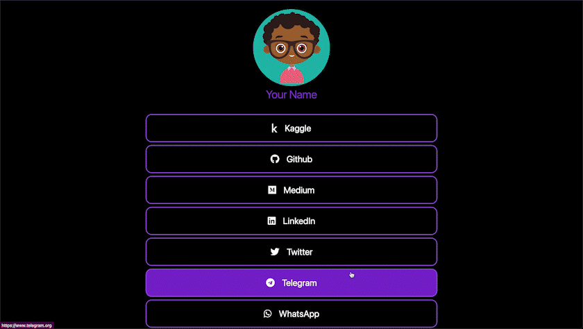
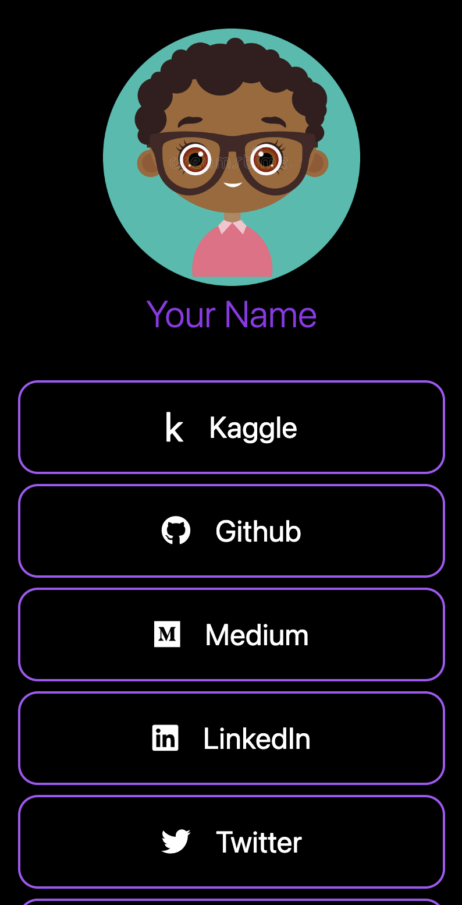

# UrLinker

    
    
    

UrLinker is a simple and customizable landing page template for showcasing your personal and professional links. It is built with React and TailwindCSS, and can be easily customized to fit your personal brand.

## Features

- Customizable links to your personal and professional pages
- Easy to modify and add additional links
- Simple and clean design
- Responsive layout for desktop and mobile devices

## Demo

To see a live demo of the UrLinker template, please visit https://urlinker.vercel.app.

## Getting Started

To get started with UrLinker, follow these steps:

1. Clone the repository to your local machine.
2. Navigate to the project directory.
3. Run npm install to install the necessary dependencies.
4. Customize the links in utils/constants.js.
5. Add your profile image to public/your_pic.png and change fields to your name in index.js and \_document.js.
6. Run npm run dev to start the development server.
7. Open http://localhost:3000 to view the template in your browser.
8. Deploy using Vercel(very easy) or your preferred hosting provider.

## Customization

UrLinker can be easily customized to fit your personal brand. Here are some of the ways you can customize the template:

- Modify the links in utils/constants.js
- Change the background color and text color in pages/\_document.js
- Tip : Use a circular image for your profile picture. Use https://crop-circle.imageonline.co/
- Change the title and header text in pages/index.js

## Contributing

Contributions are welcome! If you find a bug or would like to suggest an improvement, please open an issue or submit a pull request.
